# Interview Mate — System Architecture

## Overview

Interview Mate is an AI-powered interview simulation platform that conducts adaptive technical & behavioral interviews, analyzes coding solutions, and generates enterprise-grade candidate evaluations — all in real-time.

---

## High-Level Architecture

```mermaid
graph TB
    subgraph Client ["Frontend (Next.js 16 + React 19)"]
        HP[Home Page & Role Selection]
        AUTH[Firebase Auth - Login/Register/Google SSO]
        RESUME[Resume Upload & AI Parsing]
        VOICE[Voice Interview - Web Speech API]
        VIDEO[Video Interview - WebRTC + Webcam]
        CODE[Coding Interview - Live Editor]
        DASH[Candidate Dashboard]
        ADMIN[Admin Dashboard & Analytics]
        SKILLS[Skill Radar Visualization]
    end

    subgraph API ["API Layer (Next.js API Routes)"]
        GQ["/api/generate-questions"]
        ER["/api/evaluate-response"]
        AR["/api/analyze-resume"]
        EC["/api/evaluate-code"]
    end

    subgraph AI ["AI Engine (Google Gemini 2.5 Flash)"]
        QG[Question Generation Engine]
        RE[Response Evaluation Engine]
        RA[Resume Analysis Engine]
        CA[Code Analysis Engine]
    end

    subgraph Services ["External Services"]
        FB[Firebase Authentication]
        VC[Vercel Hosting + Edge Functions]
    end

    subgraph Proctoring ["Anti-Cheating Layer"]
        TAB[Tab Switch Detection - 3 Strike System]
        CAM[Webcam Video Proctoring]
    end

    HP --> AUTH
    AUTH --> FB
    HP --> RESUME --> AR
    HP --> CODE --> EC
    VOICE --> GQ & ER
    VIDEO --> GQ & ER
    CODE --> CAM & TAB

    AR --> RA
    GQ --> QG
    ER --> RE
    EC --> CA

    VOICE & VIDEO --> DASH
    DASH --> SKILLS
    ADMIN --> DASH
```



---

## Tech Stack

| Layer | Technology | Purpose |
|---|---|---|
| **Frontend** | Next.js 16, React 19, TypeScript | SSR, routing, UI |
| **Styling** | CSS Variables + Glassmorphism | Dark theme, responsive |
| **AI** | Google Gemini 2.5 Flash (REST API) | Question gen, evaluation, code analysis |
| **Auth** | Firebase Auth | Email/Password + Google SSO |
| **Speech** | Web Speech API | Voice interview STT/TTS |
| **Video** | WebRTC / getUserMedia | Webcam proctoring |
| **Hosting** | Vercel | Auto-deploy from GitHub |
| **Version Control** | GitHub | CI/CD pipeline |

---

## Data Flow

### 1. Candidate Interview Flow
```
Resume Upload → AI Skill Extraction → Personalized Question Generation
→ Progressive Interview (Intro → Technical → Advanced)
→ Real-time AI Evaluation (per response) → Skill Radar + Dashboard
```

### 2. Coding Interview Flow
```
Problem Selection → Live Code Editor → Submit Code
→ AI Analysis (Correctness, Time/Space Complexity, Code Quality)
→ Optimal Approach Feedback → Score Card
```

### 3. Anti-Cheating Pipeline
```
Session Start → Camera Activation → Tab Switch Monitoring
→ Warning on Switch (1st, 2nd) → Session Termination (3rd)
```

---

## Component Architecture

| Component | Responsibility |
|---|---|
| `AuthContext` | Global auth state via Firebase `onAuthStateChanged` |
| `interview-engine.ts` | Scoring logic, progressive difficulty, skill aggregation |
| `/api/generate-questions` | AI-powered question generation with difficulty scaling |
| `/api/evaluate-response` | Behavioral + technical answer evaluation (1-10 scale) |
| `/api/evaluate-code` | Code correctness, complexity, quality metrics |
| `/api/analyze-resume` | Resume parsing → skills, role, experience extraction |

---

## Scalability Considerations

- **Stateless API Routes** — Each request is independent, horizontally scalable on Vercel Edge
- **Firebase Auth** — Handles auth scaling automatically (Google-managed)
- **AI Rate Limiting** — Gemini API with configurable quotas
- **Future**: Firestore for persistent candidate data, Redis for session caching, load balancing via Vercel's global CDN
